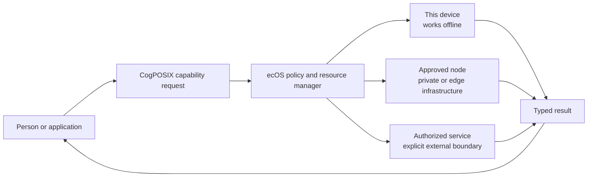
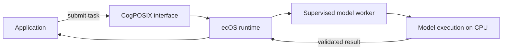

# ecOS >_CogPOSIX

**The open operating system bringing a new POSIX to machine intelligence.**

ecOS >_CogPOSIX brings machine intelligence into the operating-system contract.
Models become managed computing resources: applications submit typed workloads
through a common interface, while the system coordinates execution, memory,
resource ownership and model lifecycles.

The project combines an OS architecture, an execution runtime and CogPOSIX, its
POSIX-inspired interface for AI computation. Its scope spans vision, audio,
documents, signals, embeddings and language. An LLM is one class of model, not
the system abstraction.

ecOS >_CogPOSIX is **local-first, not local-only**. The system is designed to run
a workload in the place that policy permits and the workload requires: on the
user's device, on an approved node in a private infrastructure, or through an
explicitly authorized external service. It can keep supported tasks operational
without a network, but offline operation is a capability rather than a limitation.

The same system contract remains visible across those execution locations. The OS
retains responsibility for model identity, data access, resource limits, execution
placement and failure handling. Moving a workload off-device never becomes an
invisible fallback and never erases the new trust boundary.

## Design Principles

- **Policy-controlled placement:** select endpoint, trusted-node or authorized
  service execution according to data, capability and resource policy.
- **Operational sovereignty:** retain control over model selection, data access,
  execution location and update policy without requiring permanent connectivity.
- **Offline capability:** keep supported tasks available on provisioned devices
  when a network or external service is unavailable, undesirable or prohibited.
- **A common system interface:** typed buffers, model handles and asynchronous
  jobs provide a consistent execution contract across model classes.
- **Explicit authority:** permission to execute a model does not confer permission
  to control devices, access unrelated data or modify system policy.
- **Resource-aware performance:** bound work and memory, measure data movement and
  pursue reuse without implicitly sharing private application state.
- **Controlled decentralization:** share compute across approved nodes without
  pretending that remote execution has the same boundary as endpoint execution.
  The distributed fabric remains roadmap work.

## Community

| Place | Purpose |
| --- | --- |
| [Project website](https://logforce.github.io/) | Explore ecOS >_CogPOSIX, the roadmap, licenses and documentation. |
| [Slack](https://logforceai.slack.com/) | Introductions, help, demos and everyday collaboration. Workspace membership may be required; this link opens Slack sign-in. |
| [GitHub Discussions](https://github.com/logforce/ecosystem/discussions) | Public proposals, reusable answers and technical decisions. |
| [GitHub Issues](https://github.com/logforce/ecosystem/issues) | Reproducible bug reports and agreed development tasks. Do not include secrets or private data. |

Contribute code, review execution contracts, reproduce benchmarks or help build
the OS preview. Start a discussion for architectural changes; submit focused pull
requests with tests and DCO sign-off. See the [contribution guide](CONTRIBUTING.md).
Maintainers review changes and grant repository roles explicitly. Keep technical
decisions and reusable answers in public discussions or documentation.

## Build and Run

The available developer prototype is a local Rust runtime with a C ABI and CLI.
Start with the deterministic mock: no model download, API key or external inference
service is required. Prerequisites: Rust, a C compiler and Node.js. Linux x86-64 is
the runtime target; mock development is also tested on macOS.

```sh
cargo build --workspace --offline
node scripts/smoke.mjs
```

The smoke test starts a daemon, exercises Rust and compiled C clients, and cleans
up afterward. For real CPU inference, follow the [ONNX worker guide](docs/onnx-worker.md).
That optional path uses a pinned digit-classification model; obtain its approved
dependencies and model before offline execution. The [development guide](docs/development.md)
covers setup, testing and troubleshooting.

## Development Status

| Available and tested | In development or planned |
| --- | --- |
| Local daemon, Rust client, C ABI and CLI | Graphical Live ISO, then disk installation |
| Typed objects, bounded jobs, cancellation and cleanup | Broader capability profiles and model packages |
| Sealed shared inputs and immutable output snapshots on Linux | Resource scheduling and accelerator backends |
| Supervised CPU worker with one approved digit model | Multi-node execution and governed knowledge services |

The ABI remains experimental. A bootable OS image is not available yet, and the
runtime is not a production security boundary. Evidence reports document the
[runtime](docs/implementation-r1.md), [shared memory](docs/shared-memory.md) and
[CPU worker](docs/onnx-worker.md), including their current limits.

## System Architecture

**One project, three architectural layers:** the execution contract, the runtime
that implements it and the OS environment that delivers it.

| Layer | Responsibility | Deliverable |
| --- | --- | --- |
| CogPOSIX | Versioned execution and capability contracts | Specification, C ABI, bindings and conformance suite |
| ecOS Runtime | Shared resource management and policy | Linux services, backend adapters and administration tools |
| OS environment | Boot, desktop, services, deployment and recovery | Installable system integrating the runtime, applications and approved model packs |

At the product level, applications ask for a capability instead of hard-coding
one model provider or execution location. Policy determines where an eligible
implementation may run.



The execution choices are not equivalent. Endpoint execution can keep data and
compute on the user's machine. A trusted node crosses a machine boundary but can
remain inside an organization-controlled domain. An external service crosses an
additional administrative boundary and must be named and authorized by policy.

The developer prototype currently implements the local path:



The model engine runs inside the supervised worker; it is not a second service
after it. The runtime owns the job lifecycle and the application decides how to
use the result. The default deterministic mock runs inside the daemon, while the
optional CPU path uses a separate worker process.

Process separation and current worker restrictions are not a proven hostile-code
sandbox. GPU/NPU support, capability discovery, trusted-node execution and
authorized external-service routing remain planned. See
[architecture](docs/architecture.md) for boundaries and
[deployment examples](docs/deployment-examples.md) for OT, IoT, vision inspection,
desktop document processing and explicitly enabled multi-node execution.

## Deployment Scenarios

ecOS >_CogPOSIX targets everyday personal computing as well as professional,
edge, OT and IoT environments. A consumer laptop is a primary deployment target,
not an incidental example. Across every form factor, the objective is governed
execution with a consistent application contract and an explicit choice of where
each workload runs.

The examples below describe target integrations. Models, adapters and hardware
support must be implemented and validated for each workload.

| Use case | Computing host | Application request | System-level benefit to validate |
| --- | --- | --- | --- |
| Personal assistant | Consumer laptop | Summarize selected files, draft text or answer questions with approved models | Keep permissions and execution location visible instead of granting blanket access |
| Search and document work | Consumer laptop or desktop | OCR, semantic search, extraction and summarization | Reuse managed capabilities across applications and keep private documents on-device when policy requires it |
| Meetings and accessibility | Laptop, desktop or tablet | Denoising, transcription, translation and speech synthesis | Coordinate several model classes without sending every recording to a hosted service |
| Creative applications | Consumer or professional workstation | Image generation, enhancement, tagging and media search | Schedule CPU, GPU and NPU resources under one system policy |
| Software development | Developer workstation | Code assistance, repository search and task-specific agents | Combine local models with explicitly authorized remote capabilities without hiding data boundaries |
| Gaming and interactive media | Consumer PC or handheld | Speech, animation, adaptive characters and content moderation | Provide bounded low-latency capabilities that can continue without a network |
| OT condition monitoring | Industrial edge PC beside the machine | Analysis of bounded vibration or temperature windows | Local execution and explicit failure handling, separate from machine control |
| IoT telemetry | Gateway serving constrained sensor nodes | Batch classification of validated sensor readings | Keep inference on a capable local host without modifying every sensor |
| Visual inspection | Inspection workstation connected to a camera | Defect detection on captured frames | Common job lifecycle, model identity and bounded resource use |
| Optional shared AI node | Approved compute node in a policy domain | Explicit remote placement when authorized | Reuse compute while preserving the off-device trust boundary |

The [detailed examples](docs/deployment-examples.md) explain input ownership,
execution location, result consumers, failure behavior and evidence required for
each deployment. They do not grant model outputs authority over physical devices.

## Documentation

The [project website](index.html) introduces the runtime, roadmap and component
licenses, with an integrated documentation reader.

| Document | Questions answered |
| --- | --- |
| [Development](docs/development.md) | How do I build, run and test the working prototype? |
| [Implemented protocol](docs/protocol.md) | Which messages and lifecycle rules work now? |
| [R1 evidence](docs/implementation-r1.md) | What has been tested, and what is still missing? |
| [Shared memory](docs/shared-memory.md) | How does R2 exchange immutable tensor data outside the socket? |
| [ONNX worker](docs/onnx-worker.md) | Which real model works, how is it restricted, and what was verified? |
| [Vision and product](docs/vision.md) | What is the platform designed to deliver, and what does sovereignty mean? |
| [Architecture](docs/architecture.md) | What runs where, who owns resources, and how does execution work? |
| [Deployment examples](docs/deployment-examples.md) | How would desktop, edge and OT/IoT applications use the system, and who acts on results? |
| [Distributed intelligence](docs/distributed-intelligence.md) | How could explicitly enabled trusted nodes share compute and governed knowledge? |
| [CogPOSIX contracts](docs/cogposix.md) | What does an application rely on? What is portable? |
| [Models and capabilities](docs/models-and-capabilities.md) | How are multiple model classes packaged, evaluated and replaced? |
| [Installable OS](docs/operating-system.md) | Why Linux, which distribution approach, and what about mobile? |
| [Security](docs/security.md) | What are the trust boundaries and how can learning help defense? |
| [Adaptive optimization](docs/adaptive-optimization.md) | Can learning tune the system or change kernel behavior? |
| [Roadmap and validation](docs/roadmap.md) | What must be proven before runtime, OS and commercial releases? |
| [Decisions](docs/decisions.md) | Which choices are recorded and which remain provisional? |
| [Sources](docs/sources.md) | Which primary references informed the analysis? |
| [Contribution and governance](CONTRIBUTING.md) | How should this proposed interface evolve? |
| [License scope](LICENSE-SCOPE.md) | Which software and documentation licenses apply? |
| [Community terms](TERMS.md) | How does community use differ from optional paid services? |
| [Release information](PUBLICATION.md) | What is included, and where is the verification evidence? |

## Path to the OS Preview

Linux x86-64 remains the runtime target. The Rust mock prototype is verified on
macOS and in a non-root, offline Linux x86-64 validation container. It uses
Unix-domain sockets, bounded inline byte buffers and an experimental sealed
shared-memory path on Linux. The optional supervised ONNX Runtime CPU worker is
verified in that Linux container; it is not a production security boundary.
Hardware acceleration follows correctness and a representative customer benchmark.
Runtime packaging for existing Linux systems precedes the full OS.

The next OS artifact is a graphical Live ISO for QEMU: Debian Live/live-build,
XFCE, CPU inference and one demonstration application using CogPOSIX. Disk
installation follows live-boot validation; Docker remains build/test infrastructure.
This is planned, not an available image. No distribution version or hardware
support is promised yet. See the [platform decision](docs/operating-system.md)
and [acceptance roadmap](docs/roadmap.md).

## Licensing and Governance

CogPOSIX is the project's POSIX-inspired AI execution interface. Its specification
evolves through implementation, review and conformance evidence; it does not claim
POSIX certification or adoption as an external standard.

Public project software is Apache-2.0 and public prose is CC BY 4.0 within the explicit
[license scope](LICENSE-SCOPE.md). Third-party assets retain their own terms.

## Community and Optional Enterprise Services

The intended community runtime and installable OS work without mandatory accounts,
telemetry or LOGFORCE. Baseline policy enforcement and security remain community
features. Open event contracts can support optional analyzers, including a basic
open LOGFORCE bridge; proprietary intelligence and enterprise services are separate.
These integrations are planned, not implemented.

See the [release information](PUBLICATION.md) for scope and verification references.
