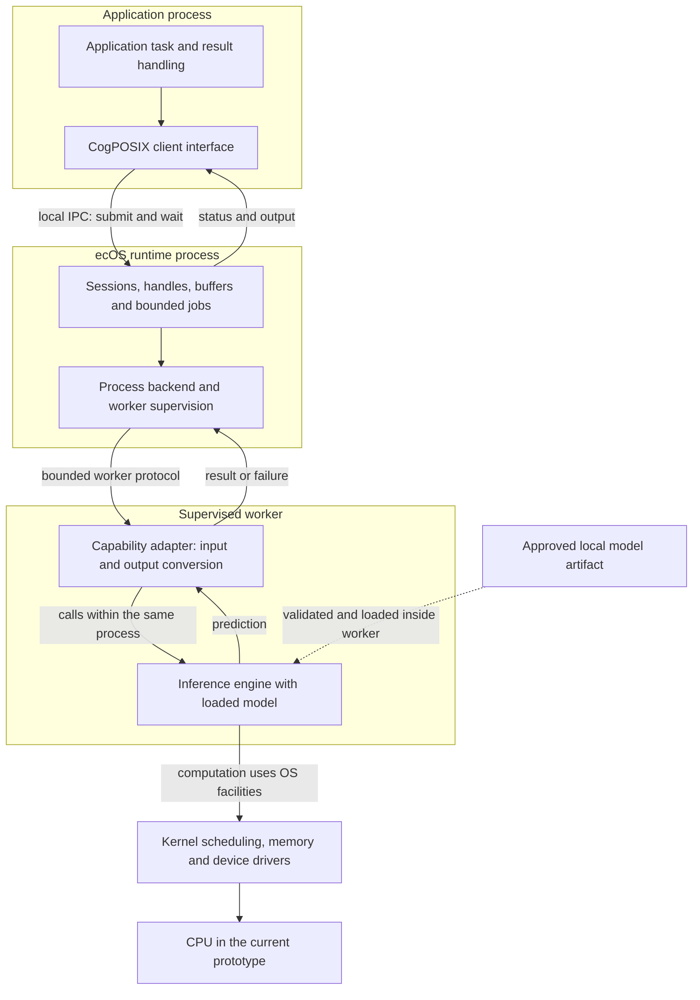

# ecOS and CogPOSIX

**ecOS >_ is our new operating system, being designed and built for local
intelligence. CogPOSIX is its own POSIX-inspired system interface for controlled AI.**

This is an original operating-system project, not an integration or distribution
of a third-party product named ecOS. The runtime prototype currently runs on Linux;
the complete installable OS remains in development.

ecOS treats inference as a shared system resource. CogPOSIX defines the interface
applications use to acquire models, exchange typed data, submit computation and
observe its execution. Models include vision, audio, OCR, embeddings, translation,
time-series analysis and language models. An LLM is one possible provider.

## Community Links

| Place | Purpose |
| --- | --- |
| [Project website](https://logforce.github.io/) | Explore ecOS and CogPOSIX, the roadmap, licenses and documentation. |
| [Slack](https://logforceai.slack.com/) | Introductions, help, demos and everyday collaboration. Workspace membership may be required; this link opens Slack sign-in. |
| [GitHub Discussions](https://github.com/logforce/ecosystem/discussions) | Public proposals, reusable answers and technical decisions. |
| [GitHub Issues](https://github.com/logforce/ecosystem/issues) | Reproducible bug reports and agreed development tasks. Do not include secrets or private data. |

Community membership does not grant repository write access. Contributor roles
and changes to the official project require maintainer approval. See the
[contribution guide](CONTRIBUTING.md). Keep lasting answers and decisions in public
discussions or documentation so participation does not depend on Slack.

## Status

The first experimental runtime is implemented: a local daemon, Rust client, C ABI,
CLI and deterministic mock backend. It exercises resource ownership, asynchronous
jobs, cancellation and cleanup without downloading models or contacting a service.
Linux also supports descriptor-passed, sealed shared inputs and immutable output
snapshots. See the [shared-memory contract](docs/shared-memory.md).
An optional Linux ONNX Runtime CPU worker now executes one pinned handwritten-digit
model through the same Rust and C interface. See the [R3 worker report](docs/onnx-worker.md).
There is no installer or bootable ecOS image yet. The ABI is experimental, not
frozen; the wider design remains a roadmap.

See [development instructions](docs/development.md), the
[implemented protocol](docs/protocol.md) and [evidence and limitations](docs/implementation-r1.md).

```sh
cargo build --workspace --offline
node scripts/smoke.mjs
```

The smoke test starts its own daemon, runs the CLI and compiled C clients, and
stops the daemon. Rust, a C compiler and Node.js are required.

The [specification guide](SPEC.md) introduces the public design baseline.
Research proposals are separated from release requirements and demonstrated results.
The original planning attachment is not part of the public distribution.

## Two Names, Two Responsibilities

| Name | Responsibility | Intended deliverable |
| --- | --- | --- |
| CogPOSIX | Versioned execution and capability contracts | Specification, C ABI, bindings and conformance suite |
| ecOS Runtime | Shared resource management and policy | Linux services, backend adapters and administration tools |
| ecOS OS | Complete sovereign computing environment | Installable Linux system with supported hardware, applications and model packs |

Models act as capability providers, analogous to the way drivers expose hardware
services. They do **not** replace hardware drivers. Quality and semantic
compatibility must be validated when substituting models.



This shows the optional **implemented Linux CPU worker path**, not a completed
installable OS. The engine runs **inside** the supervised worker: these are not
two successive inference services. The default deterministic mock runs inside
the daemon and does not use this worker path. The kernel serves all processes;
its placement in the drawing highlights execution, not exclusive worker access.

Process separation and current worker restrictions are not a proven hostile-code
sandbox. GPU/NPU support, capability discovery and distributed execution remain
planned. See [architecture](docs/architecture.md) for boundaries and
[deployment examples](docs/deployment-examples.md) for OT, IoT, vision inspection,
desktop document processing and explicitly enabled multi-node execution.

## Where It Fits

These are target deployments, not integrations already shipped. ecOS >_ is
installed on the supported computing host; CogPOSIX is its application interface,
not firmware automatically added to every connected sensor or PLC.

| Use case | Where ecOS runs | What the application requests | Why use the system contract? |
| --- | --- | --- | --- |
| OT condition monitoring | Industrial edge PC beside the machine | Analysis of bounded vibration or temperature windows | Local execution and explicit failure handling, separate from machine control |
| IoT telemetry | Gateway serving constrained sensor nodes | Batch classification of validated sensor readings | Keep inference on a capable local host without modifying every sensor |
| Visual inspection | Inspection workstation connected to a camera | Defect detection on captured frames | Common job lifecycle, model identity and bounded resource use |
| Document processing | User workstation | Separate layout, OCR and extraction jobs | Local data handling and explicit application review of uncertain results |
| Optional shared AI node | Approved compute node in a policy domain | Explicit remote placement when authorized | Reuse compute while preserving the off-device trust boundary |

The [detailed examples](docs/deployment-examples.md) explain input ownership,
execution location, result consumers, failure behavior and evidence required for
each deployment. They do not grant model outputs authority over physical devices.

## Product Principles

- Run ordinary algorithms when they adequately solve the task.
- Use approved local models when they meet quality and resource requirements.
- Keep model identity, execution location, permissions and resource use visible.
- Make off-device execution an explicit policy decision, never a silent fallback.
- Reuse model resources across participating applications without sharing private state.
- Preserve a small execution interface and version capability semantics separately.
- Keep security enforcement independent of learned predictions.
- Deliver a usable installable OS on an existing kernel and driver ecosystem.

## Start Reading

The [project website](index.html) introduces the runtime, roadmap and component
licenses, with an integrated documentation reader.

| Document | Questions answered |
| --- | --- |
| [Development](docs/development.md) | How do I build, run and test the working prototype? |
| [Implemented protocol](docs/protocol.md) | Which messages and lifecycle rules work now? |
| [R1 evidence](docs/implementation-r1.md) | What has been tested, and what is still missing? |
| [Shared memory](docs/shared-memory.md) | How does R2 exchange immutable tensor data outside the socket? |
| [ONNX worker](docs/onnx-worker.md) | Which real model works, how is it restricted, and what was verified? |
| [Vision and product](docs/vision.md) | What are we building, for whom, and what does sovereignty mean? |
| [Architecture](docs/architecture.md) | What runs where, who owns resources, and how does execution work? |
| [Deployment examples](docs/deployment-examples.md) | Where would ecOS run in OT/IoT, what crosses CogPOSIX, and who acts on results? |
| [Distributed intelligence](docs/distributed-intelligence.md) | How could explicitly enabled trusted nodes share compute and governed knowledge? |
| [CogPOSIX contracts](docs/cogposix.md) | What does an application rely on? What is portable? |
| [Models and capabilities](docs/models-and-capabilities.md) | How are multiple model classes packaged, evaluated and replaced? |
| [Installable OS](docs/operating-system.md) | Why Linux, which distribution approach, and what about mobile? |
| [Security](docs/security.md) | What are the trust boundaries and how can learning help defense? |
| [Adaptive optimization](docs/adaptive-optimization.md) | Can learning tune the system or change kernel behavior? |
| [Roadmap and validation](docs/roadmap.md) | What must be proven before runtime, OS and commercial releases? |
| [Decisions](docs/decisions.md) | Which choices are recorded and which remain provisional? |
| [Sources](docs/sources.md) | Which primary references informed the analysis? |
| [Contribution and governance](CONTRIBUTING.md) | How should this proposed interface evolve? |
| [License scope](LICENSE-SCOPE.md) | Which software and documentation licenses apply? |
| [Community terms](TERMS.md) | How does community use differ from optional paid services? |
| [Release information](PUBLICATION.md) | What is included, and where is the verification evidence? |

## Initial Technical Direction

Linux x86-64 remains the runtime target. The Rust mock prototype is verified on
macOS and in a non-root, offline Linux x86-64 validation container. It uses
Unix-domain sockets, bounded inline byte buffers and an experimental sealed
shared-memory path on Linux. The optional supervised ONNX Runtime CPU worker is
verified in that Linux container; it is not a production security boundary.
Hardware acceleration follows correctness and a representative customer benchmark.
Runtime packaging for existing Linux systems precedes the full OS.

The next OS artifact is a graphical Live ISO for QEMU: Debian Live/live-build,
XFCE, CPU inference and one demonstration application using CogPOSIX. Disk
installation follows live-boot validation; Docker remains build/test infrastructure.
This is planned, not an available image. No distribution version or hardware
support is promised yet. See the [platform decision](docs/operating-system.md)
and [acceptance roadmap](docs/roadmap.md).

## What Is Not Claimed

CogPOSIX is POSIX-inspired; it is not POSIX certification, an IEEE standard, a
replacement for POSIX, or proof of universal model portability. ecOS does not
promise zero-cost computation, hard real-time inference, automatic prevention of
all cyberattacks, or unrestricted autonomous kernel modification.

Public project software is Apache-2.0 and public prose is CC BY 4.0 within the explicit
[license scope](LICENSE-SCOPE.md). Third-party assets retain their own terms.

## Community and Optional Enterprise Services

The intended community runtime and installable OS work without mandatory accounts,
telemetry or LOGFORCE. Baseline policy enforcement and security remain community
features. Open event contracts can support optional analyzers, including a basic
open LOGFORCE bridge; proprietary intelligence and enterprise services are separate.
These integrations are planned, not implemented.

See the [release information](PUBLICATION.md) for scope and verification references.
