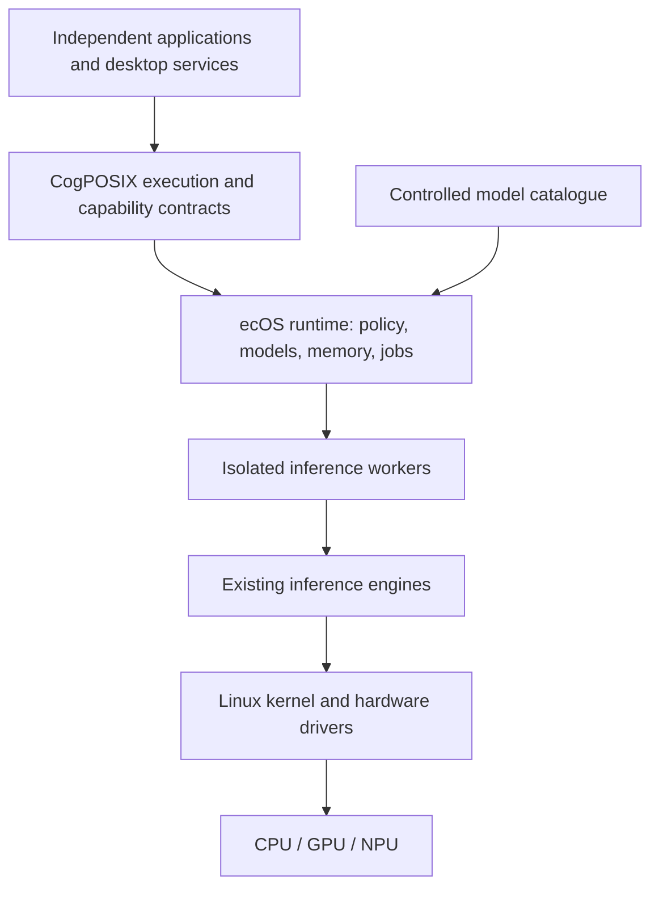

# ecOS and CogPOSIX

**A sovereign AI operating environment in which applications access controlled,
specialized models through a common system interface.**

ecOS treats inference as a shared system resource. CogPOSIX defines the interface
applications use to acquire models, exchange typed data, submit computation and
observe its execution. Models include vision, audio, OCR, embeddings, translation,
time-series analysis and language models. An LLM is one possible provider.

## Status

This repository currently contains design and business documentation. There is no
runtime, SDK, model bundle, installer or bootable ecOS image yet. Examples are
proposed contracts, not commands or APIs that can currently be executed.

The original [v0.1 specification](ecOS_CogPOSIX_Project_Specification_v0.1.docx)
is retained unchanged. The [specification guide](SPEC.md) explains how the expanded
documentation relates to it. Research and commercial claims are explicitly
separated from release requirements and demonstrated results.

## Two Names, Two Responsibilities

| Name | Responsibility | Intended deliverable |
| --- | --- | --- |
| CogPOSIX | Versioned execution and capability contracts | Specification, C ABI, bindings and conformance suite |
| ecOS Runtime | Shared resource management and policy | Linux services, backend adapters and administration tools |
| ecOS OS | Complete sovereign computing environment | Installable Linux system with supported hardware, applications and model packs |

Models act as capability providers, analogous to the way drivers expose hardware
services. They do **not** replace hardware drivers. Quality and semantic
compatibility must be validated when substituting models.

## Product Principles

- Run ordinary algorithms when they adequately solve the task.
- Use approved local models when they meet quality and resource requirements.
- Keep model identity, execution location, permissions and resource use visible.
- Make off-device execution an explicit policy decision, never a silent fallback.
- Reuse model resources across participating applications without sharing private state.
- Preserve a small execution interface and version capability semantics separately.
- Keep security enforcement independent of learned predictions.
- Deliver a usable installable OS on an existing kernel and driver ecosystem.

## Start Reading

| Document | Questions answered |
| --- | --- |
| [Vision and product](docs/vision.md) | What are we building, for whom, and what does sovereignty mean? |
| [Architecture](docs/architecture.md) | What runs where, who owns resources, and how does execution work? |
| [CogPOSIX contracts](docs/cogposix.md) | What does an application rely on? What is portable? |
| [Models and capabilities](docs/models-and-capabilities.md) | How are multiple model classes packaged, evaluated and replaced? |
| [Installable OS](docs/operating-system.md) | Why Linux, which distribution approach, and what about mobile? |
| [Security](docs/security.md) | What are the trust boundaries and how can learning help defense? |
| [Adaptive optimization](docs/adaptive-optimization.md) | Can learning tune the system or change kernel behavior? |
| [Business impact](docs/business-impact.md) | Who pays, why, how much might work, and what attracts investment? |
| [Roadmap and validation](docs/roadmap.md) | What must be proven before runtime, OS and commercial releases? |
| [Decisions](docs/decisions.md) | Which choices are recorded and which remain provisional? |
| [Sources](docs/sources.md) | Which primary references informed the analysis? |
| [Contribution and governance](CONTRIBUTING.md) | How should this proposed interface evolve? |

## Initial Technical Direction

The runtime starts with Linux x86-64, Rust services, a draft C ABI, Unix-domain
control messages, shared host memory, a deterministic mock backend and ONNX Runtime
CPU. Hardware acceleration follows correctness and one representative customer
benchmark. The initial runtime is also installable on an existing Linux system.

The preferred OS prototype is a Fedora-based bootc image, subject to installer,
hardware and recovery validation. Debian Live is the documented fallback. The
project does not yet commit to a particular distribution release or claim a
supported device list. See the [platform decision](docs/operating-system.md).

## What Is Not Claimed

CogPOSIX is POSIX-inspired; it is not POSIX certification, an IEEE standard, a
replacement for POSIX, or proof of universal model portability. ecOS does not
promise zero-cost computation, hard real-time inference, automatic prevention of
all cyberattacks, or unrestricted autonomous kernel modification.

Both names are provisional. The existing [eCos RTOS](https://ecos.sourceware.org/)
creates a naming collision. Publication naming and licensing remain unresolved;
an intention to develop an open interface is not a license grant for these files
or third-party models. See [governance](CONTRIBUTING.md).
