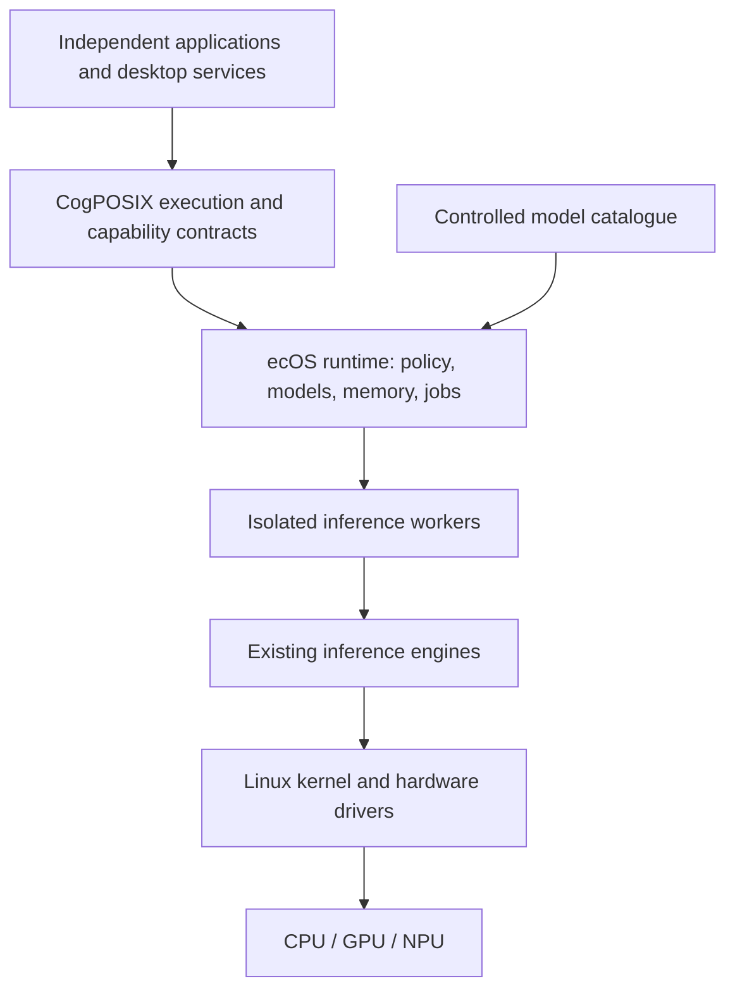

# ecOS and CogPOSIX

**A sovereign AI operating environment in which applications access controlled,
specialized models through a common system interface.**

ecOS treats inference as a shared system resource. CogPOSIX defines the interface
applications use to acquire models, exchange typed data, submit computation and
observe its execution. Models include vision, audio, OCR, embeddings, translation,
time-series analysis and language models. An LLM is one possible provider.

## Status

The first experimental runtime is implemented: a local daemon, Rust client, C ABI,
CLI and deterministic mock backend. It exercises resource ownership, asynchronous
jobs, cancellation and cleanup without downloading models or contacting a service.
There is no real inference engine, model bundle, installer or bootable ecOS image
yet. The ABI is experimental, not frozen; the wider design remains a roadmap.

See [development instructions](docs/development.md), the
[implemented protocol](docs/protocol.md) and [evidence and limitations](docs/implementation-r1.md).

```sh
cargo build --workspace --offline
node scripts/smoke.mjs
```

The smoke test starts its own daemon, runs the CLI and compiled C clients, and
stops the daemon. Rust, a C compiler and Node.js are required.

The [specification guide](SPEC.md) introduces the public design baseline.
Research proposals are separated from release requirements and demonstrated results.
The original planning attachment is not part of the public distribution.

## Two Names, Two Responsibilities

| Name | Responsibility | Intended deliverable |
| --- | --- | --- |
| CogPOSIX | Versioned execution and capability contracts | Specification, C ABI, bindings and conformance suite |
| ecOS Runtime | Shared resource management and policy | Linux services, backend adapters and administration tools |
| ecOS OS | Complete sovereign computing environment | Installable Linux system with supported hardware, applications and model packs |

Models act as capability providers, analogous to the way drivers expose hardware
services. They do **not** replace hardware drivers. Quality and semantic
compatibility must be validated when substituting models.



## Product Principles

- Run ordinary algorithms when they adequately solve the task.
- Use approved local models when they meet quality and resource requirements.
- Keep model identity, execution location, permissions and resource use visible.
- Make off-device execution an explicit policy decision, never a silent fallback.
- Reuse model resources across participating applications without sharing private state.
- Preserve a small execution interface and version capability semantics separately.
- Keep security enforcement independent of learned predictions.
- Deliver a usable installable OS on an existing kernel and driver ecosystem.

## Start Reading

| Document | Questions answered |
| --- | --- |
| [Development](docs/development.md) | How do I build, run and test the working prototype? |
| [Implemented protocol](docs/protocol.md) | Which messages and lifecycle rules work now? |
| [R1 evidence](docs/implementation-r1.md) | What has been tested, and what is still missing? |
| [Vision and product](docs/vision.md) | What are we building, for whom, and what does sovereignty mean? |
| [Architecture](docs/architecture.md) | What runs where, who owns resources, and how does execution work? |
| [CogPOSIX contracts](docs/cogposix.md) | What does an application rely on? What is portable? |
| [Models and capabilities](docs/models-and-capabilities.md) | How are multiple model classes packaged, evaluated and replaced? |
| [Installable OS](docs/operating-system.md) | Why Linux, which distribution approach, and what about mobile? |
| [Security](docs/security.md) | What are the trust boundaries and how can learning help defense? |
| [Adaptive optimization](docs/adaptive-optimization.md) | Can learning tune the system or change kernel behavior? |
| [Roadmap and validation](docs/roadmap.md) | What must be proven before runtime, OS and commercial releases? |
| [Decisions](docs/decisions.md) | Which choices are recorded and which remain provisional? |
| [Sources](docs/sources.md) | Which primary references informed the analysis? |
| [Contribution and governance](CONTRIBUTING.md) | How should this proposed interface evolve? |
| [License scope](LICENSE-SCOPE.md) | Which software and documentation licenses apply? |
| [Community terms](TERMS.md) | How does community use differ from optional paid services? |
| [Publication boundary](PUBLICATION.md) | Which files may be included in a public release? |

## Initial Technical Direction

Linux x86-64 remains the runtime target. The Rust mock prototype is verified on
macOS and in a non-root, offline Linux x86-64 validation container. It uses
Unix-domain sockets and bounded inline byte buffers. Shared host memory and an
isolated ONNX Runtime CPU worker are the next milestones, not existing features.
Hardware acceleration follows correctness and a representative customer benchmark.
Runtime packaging for existing Linux systems precedes the full OS.

The preferred OS prototype is a Fedora-based bootc image, subject to installer,
hardware and recovery validation. Debian Live is the documented fallback. The
project does not yet commit to a particular distribution release or claim a
supported device list. See the [platform decision](docs/operating-system.md).

## What Is Not Claimed

CogPOSIX is POSIX-inspired; it is not POSIX certification, an IEEE standard, a
replacement for POSIX, or proof of universal model portability. ecOS does not
promise zero-cost computation, hard real-time inference, automatic prevention of
all cyberattacks, or unrestricted autonomous kernel modification.

Both names are provisional. The existing [eCos RTOS](https://ecos.sourceware.org/)
creates a naming collision; naming clearance remains unresolved. Public project
software is Apache-2.0 and public prose is CC BY 4.0 within the explicit
[license scope](LICENSE-SCOPE.md). Third-party assets retain their own terms.

## Community and Optional Enterprise Services

The intended community runtime and installable OS work without mandatory accounts,
telemetry or LOGFORCE. Baseline policy enforcement and security remain community
features. Open event contracts can support optional analyzers, including a basic
open LOGFORCE bridge; proprietary intelligence and enterprise services are separate.
These integrations are planned, not implemented.

Maintainers must use the [allowlisted publication procedure](PUBLICATION.md).
The mixed working repository's history must not seed a public remote directly.
